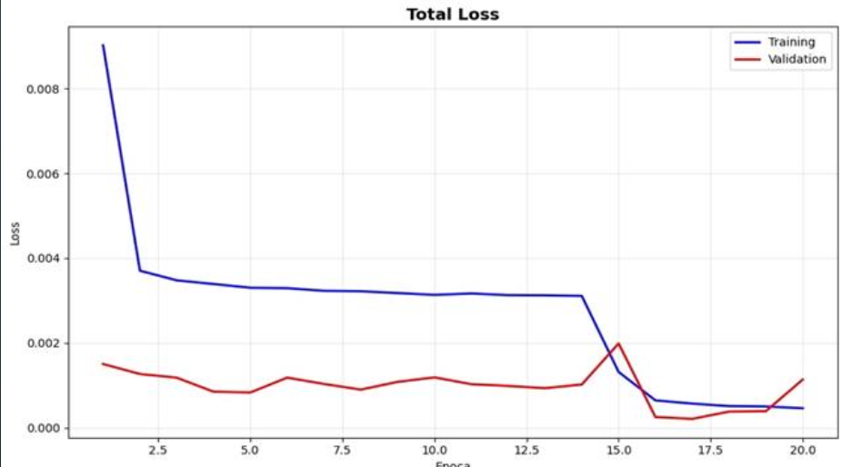
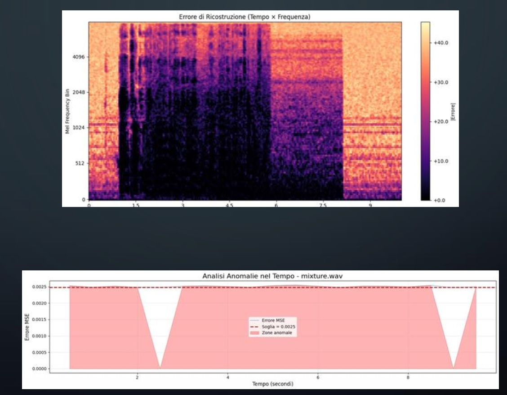

# Audio Anomaly Detection and Source Separation using Deep Learning

Audio processing project focused on human voice detection and audio source separation using Deep Learning architectures based on U-Net and BiLSTM networks.

Developed as part of the **Artificial Intelligence and Machine Learning** course within the M.Sc. in Data Science and Innovation Management at the University of Salerno.

---

## Repository Notice

This repository contains the academic documentation, methodology and experimental results of the project.

The original source code developed during the course is no longer available. The repository is intended to document the architecture, workflow and outcomes of the work.

---

## Key Highlights

- Custom U-Net architectures with BiLSTM integration
- Non-supervised anomaly detection for human voice identification
- Supervised audio source separation
- PyTorch-based Deep Learning pipeline
- Common Voice, ESC-50 and UrbanSound8K datasets
- Audio preprocessing and augmentation
- Whisper-based transcription evaluation
- More than 10 million trainable parameters

---

## Project Overview

The project addresses two closely related tasks in real-world audio processing:

### Task 1 — Audio Anomaly Detection

Development of a non-supervised Deep Learning system capable of detecting the presence of human voices within noisy environmental audio recordings.

The model learns the acoustic characteristics of background sounds and automatically identifies voice events as anomalies.

### Task 2 — Audio Source Separation

Development of a supervised audio separation architecture capable of isolating human speech from environmental noise.

The system reconstructs two independent audio streams:

- Voice component
- Background component

This allows cleaner speech extraction and improved intelligibility in noisy environments.

---

## Motivation

Human voice detection and separation are fundamental tasks in modern Artificial Intelligence systems.

Potential applications include:

- Speech enhancement
- Audio surveillance
- Smart assistants
- Environmental monitoring
- Public safety systems
- Emergency detection
- Speech recognition pipelines

---

## Datasets

The project combines public datasets containing speech and environmental sounds.

### Voice Dataset

- Mozilla Common Voice

### Environmental Audio Datasets

- ESC-50
- UrbanSound8K

Audio samples were filtered to obtain clips between 5 and 9 seconds in duration to ensure dataset consistency.

---

## Data Preparation Pipeline

The dataset preparation process included:

1. Collection of voice and background recordings
2. Dataset splitting:
   - Training (80%)
   - Validation (10%)
   - Test (10%)
3. Generation of synthetic audio mixtures
4. Creation of:
   - Voice tracks
   - Background tracks
   - Mixed audio tracks
5. Export of dataset metadata into CSV files

Each sample contains:

```text
background.wav
voice.wav
mixture.wav
```

---

## Task 1: Audio Anomaly Detection

### Objective

Detect the presence of human speech within environmental audio recordings.

### Learning Strategy

The model is trained only on background audio.

During inference:

- Background sounds are considered normal patterns
- Human speech is treated as an anomaly

### Anomaly Detection Architecture


The anomaly detection model is based on a custom U-Net architecture enhanced with BiLSTM layers for temporal modeling.

The network learns the acoustic structure of background sounds and identifies human speech as anomalous events through reconstruction quality analysis.

### Output

The network produces:

- Voice component
- Background component

allowing anomaly localization and interpretation.

---

## Task 2: Audio Source Separation

### Objective

Separate speech signals from environmental noise.

### Audio Separation Architecture


The supervised source separation model follows a Wave-U-Net inspired architecture and reconstructs independent voice and background signals from a mixed audio recording.

### Architecture Features

- Encoder-Decoder structure
- Skip Connections
- Residual information flow
- BiLSTM temporal modeling
- Multi-level feature extraction

### Training Strategy

The supervised model receives:

```text
Input:
Mixture Audio

Targets:
Voice Track
Background Track
```

The model learns to reconstruct both components simultaneously.

---

## Audio Preprocessing

Audio preprocessing was performed using Librosa and PyTorch.

Main operations:

- Mono conversion
- Resampling to 16 kHz
- Padding and truncation
- RMS normalization
- Amplitude normalization
- Data augmentation

The preprocessing pipeline improves training stability and model robustness.

---

## Training Configuration

### Loss Function

L1 Loss

Advantages:

- Robust against outliers
- Stable convergence
- Effective for waveform reconstruction

### Optimizer

AdamW

Advantages:

- Better generalization
- Reduced overfitting
- Stable optimization

### Training Workflow



The training pipeline includes preprocessing, mini-batch generation, optimization with AdamW, checkpoint management and validation monitoring.

---

## Evaluation Metrics

The models were evaluated using:

- SDR (Signal-to-Distortion Ratio)
- SNR (Signal-to-Noise Ratio)
- Pearson Correlation
- MAE (Mean Absolute Error)
- MSE (Mean Squared Error)

---

## Experimental Results

### Training Performance


Training and validation losses show stable convergence and good generalization capabilities throughout the optimization process.

### Anomaly Detection Results

| Metric | Value |
|----------|----------|
| Processed Files | 15,643 |
| Mean Error | 0.0307 |
| Standard Deviation | 0.0279 |
| Minimum Error | 0.0000 |
| Maximum Error | 0.1746 |

The anomaly detector demonstrated robust performance on unseen audio samples and successfully identified voice events embedded in environmental noise.

### Audio Source Separation Results

| Metric | Event |
|----------|----------|
| SDR | 14.27 |
| Correlation | 0.94 |
| MAE | 0.0170 |
| MSE | 0.00168 |

| Metric | Background |
|----------|----------|
| SDR | 6.03 |
| Correlation | 0.82 |
| MAE | 0.0170 |
| MSE | 0.00162 |

The source separation architecture achieved effective reconstruction of human speech while preserving environmental background information.

---

## Inference Pipeline



The inference workflow processes unseen audio recordings and evaluates reconstruction quality to identify anomalous voice events and generate alert signals.

---

## Whisper Evaluation

The reconstructed speech signals were further evaluated using OpenAI Whisper.

The transcription quality confirmed that the separated speech preserved the original linguistic content with high accuracy, demonstrating the effectiveness of the source separation pipeline.

---

## Repository Contents

```text
.
├── README.md
├── docs/
│   └── Audio_Anomaly_Detection_Presentation.pdf
│
└── figures/
    ├── Anomaly-detector-u-net.png
    ├── Audio-Separation-architecture U net.png
    ├── Inferenza-in-Anomaly-Detection.png
    ├── Training-Loop.png
    └── TrainingVsValidation Loss.png
```

---

## Technologies

- Python
- PyTorch
- Librosa
- NumPy
- Deep Learning
- U-Net
- Wave-U-Net
- BiLSTM
- Audio Signal Processing
- OpenAI Whisper

---

## Academic Context

Course:

**Artificial Intelligence and Machine Learning**

M.Sc. in Data Science and Innovation Management

University of Salerno

---

## Authors

**Giuseppe Rega**  
**Asia Bruno**  
**Felicita Giliberti**  
**Pasquale Langelotti**
